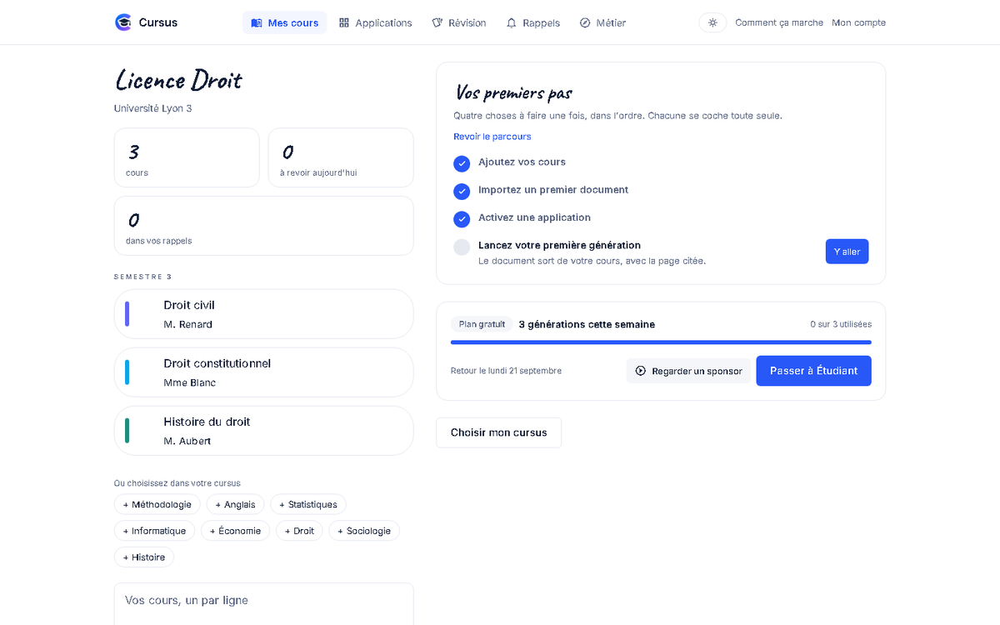
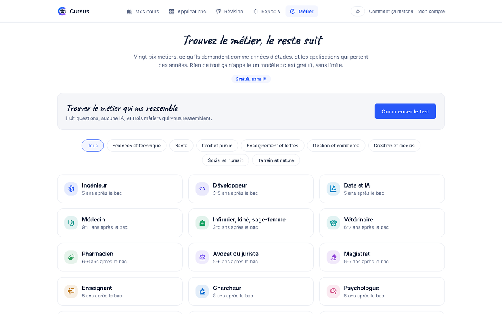
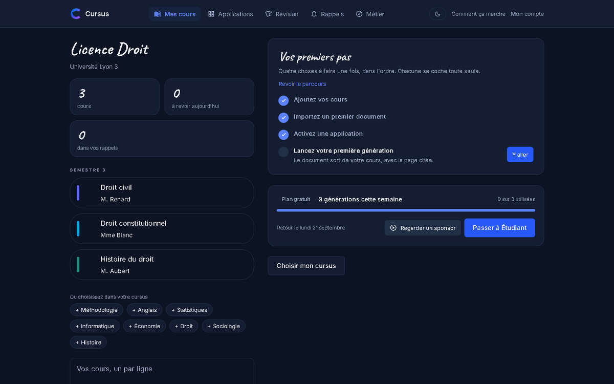
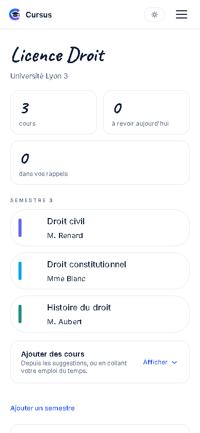
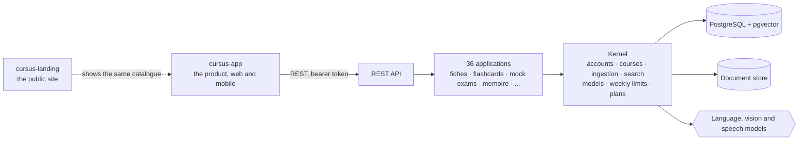

# Cursus

**All of your studies on one platform.**

A student imports their courses once. Cursus draws their summary sheets, their
flashcards, their mock exams and their revision plan out of those courses, and
cites their own documents rather than an unknown source.

## The idea that shapes everything

The thirty-six features of the product are not thirty-six products. They are
thirty-six readings of the same thing: the student's own course.

Sheets, flashcards, quizzes, mock exams, the panic mode the night before a
test, a forecast of what the exam will ask, a record of the mistakes that keep
coming back: all of it starts from one corpus, imported and analysed once.

That is what separates Cursus from a general assistant. The expensive work
happens once, each application reads it from its own angle, and every answer
cites the passage of the course it came from.

## The product

A course is fed once, from a handout, a photo of the board or a recording.
Everything the student turns in afterwards comes out of it, with the page in
front of it.

| | |
|---|---|
|  |  |
| Twenty-six trades, the years they ask for, and the applications that carry those years. | Light or dark, following the machine until the student says otherwise. |

## How it fits together

An application never opens a file or calls a model by itself: it goes through
the kernel, and the build refuses any module that tries. That rule is what
keeps thirty-six applications from becoming thirty-six little products with
thirty-six ways of spending money.

## The model

Odoo's: a kernel, and applications you turn on as you need them. The kernel
carries what an application is never allowed to do by itself: accounts, the
tree of studies, document import, search across the corpus and access to the
language models.

The boundaries between modules are checked at build time. A module that goes
around the kernel breaks the build, not production.

## What it costs

The free plan is a real week: three generations, a queue, and a fifteen second
sponsor that gives one back. Everything that never calls a model, half the
catalogue, stays free and unlimited. Paid plans lift the week and drop the
queue.

## The repositories

| Repository | What is in it |
| --- | --- |
| [`cursus-back`](https://github.com/CursusFR/cursus-back) | The API. Java 21, Spring Boot, Spring Modulith, PostgreSQL with pgvector. |
| [`cursus-app`](https://github.com/CursusFR/cursus-app) | The product: one Expo application, on the web today and in the stores from the same code. |
| [`cursus-landing`](https://github.com/CursusFR/cursus-landing) | The public site, standing alone so it can deploy without the product. |

The roadmap of the applications is on the
[organisation board](https://github.com/orgs/CursusFR/projects/6), ordered by
commercial priority: first what triggers a subscription, then what brings a
student back every week, and last what needs a crowd to be worth anything.

## Where it stands

The kernel is complete and exercised in tests. Thirty-six applications are in
the catalogue, the tour, the weekly limits, the sponsor and the plans are in
place, and the interface exists in French and English, in daylight and after
dark.
