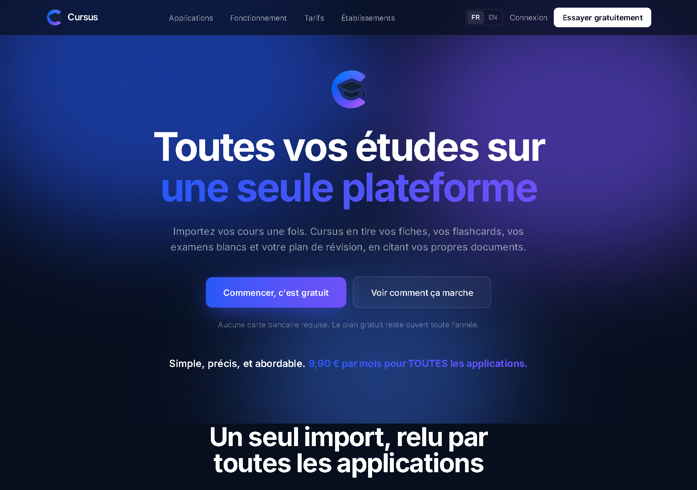
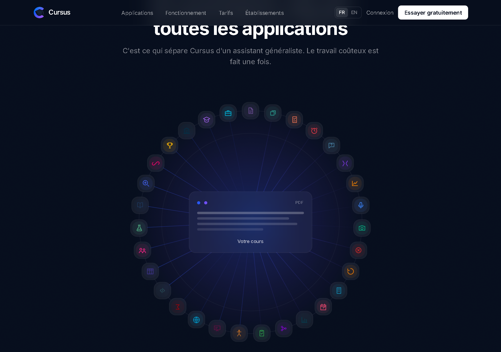

# Cursus

**Toutes vos études sur une seule plateforme.**

L'étudiant importe ses cours une fois. Cursus en tire ses fiches, ses
flashcards, ses examens blancs et son plan de révision, en citant ses propres
documents plutôt qu'une source inconnue.

## L'idée qui structure tout

Les 31 fonctionnalités du produit ne sont pas 31 produits. Ce sont 31 lectures
différentes du même contenu : le cours de l'étudiant.

Fiches, flashcards, QCM, examens blancs, mode urgence avant un partiel,
prévision des notions qui tomberont, détection des erreurs récurrentes : tout
part du même corpus, importé et analysé une seule fois.

C'est ce qui sépare Cursus d'un assistant généraliste. Le travail coûteux est
fait une fois, chaque application le relit sous son angle, et chaque réponse
cite le passage du cours dont elle vient.

Le site public dessine cet argument plutôt que de l'énoncer : le document au
centre, les trente et une applications autour.

## Le modèle

Celui d'Odoo : un noyau, et des applications qu'on active selon ses besoins.
Le noyau porte ce qu'une application n'a pas le droit de faire elle-même :
les comptes, l'arborescence des études, l'import des documents, la recherche
dans le corpus et l'accès aux modèles de langage.

Les frontières entre modules sont vérifiées à la compilation. Un module qui
contourne le noyau casse le build, pas la production.

## Les dépôts

| Dépôt | Contenu |
| --- | --- |
| [`cursus-back`](https://github.com/CursusFR/cursus-back) | L'API. Java 21, Spring Boot, Spring Modulith, PostgreSQL avec pgvector. |
| [`cursus-app`](https://github.com/CursusFR/cursus-app) | L'application web (Next.js) et l'application mobile (Expo), avec leur socle commun. |
| [`cursus-landing`](https://github.com/CursusFR/cursus-landing) | Le site public, autonome pour se déployer sans dépendre du produit. |

La feuille de route des 31 applications est sur le
[tableau de l'organisation](https://github.com/orgs/CursusFR/projects/6),
classée par ordre de priorité commerciale : d'abord ce qui déclenche
l'abonnement, ensuite ce qui fait revenir chaque semaine, enfin ce qui demande
une masse critique d'utilisateurs.

## L'état aujourd'hui

Le noyau est complet et vérifié en exécution. Deux applications sont livrées,
les fiches de révision et les flashcards en répétition espacée. L'interface
existe en français et en anglais.
