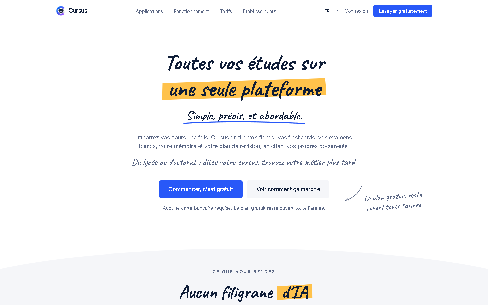
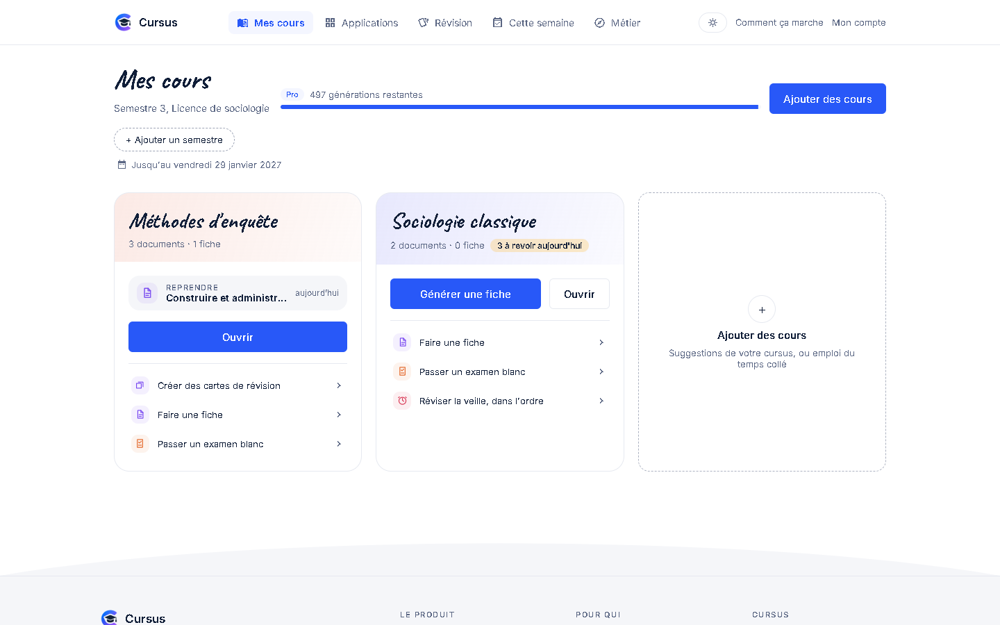
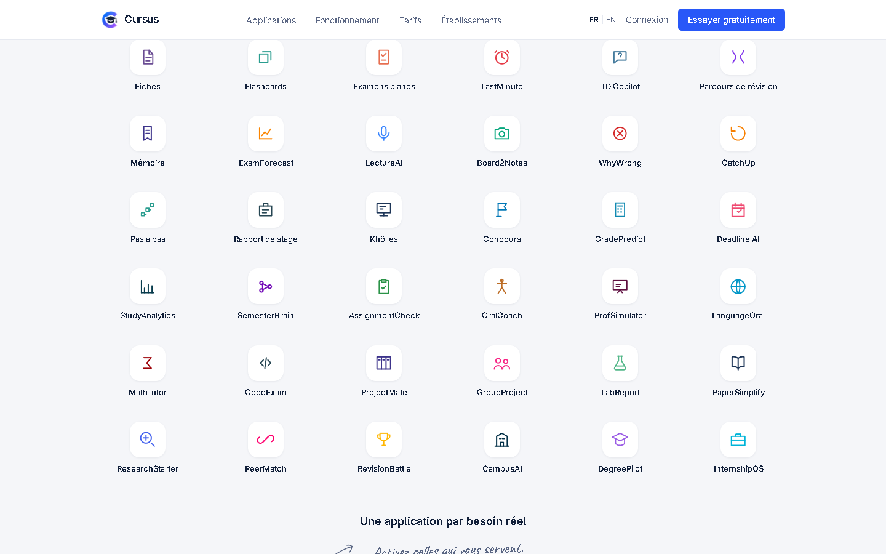
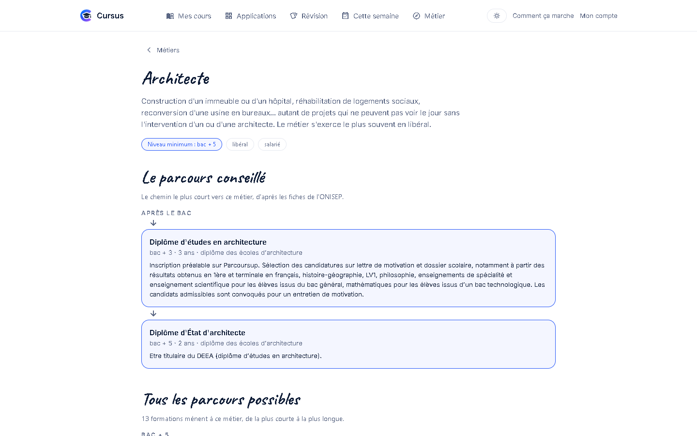
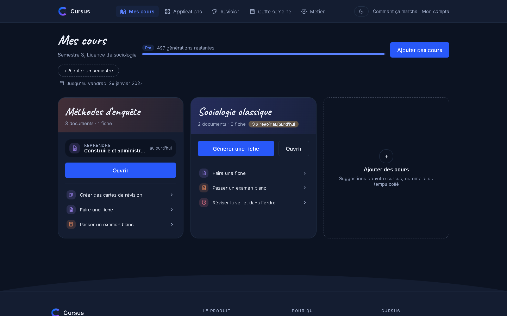
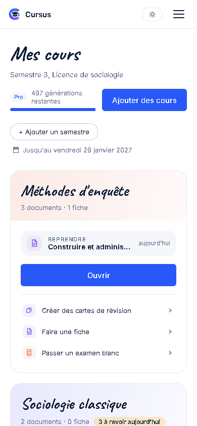

# Cursus

**All of your studies on one platform.**

A student imports their courses once. Cursus draws their summary sheets, their
flashcards, their mock exams and their revision plan out of those courses, and
cites their own documents rather than an unknown source.

## The product

A course is fed once, from a handout, a photo of the board or a recording.
Thirty-six applications read it, and every answer cites the passage it came
from. Nothing that comes out carries a watermark.

|                                                                                                                     |                                                                       |
| ------------------------------------------------------------------------------------------------------------------- | --------------------------------------------------------------------- |
|                                                                     |                                         |
| Over a thousand jobs from ONISEP's open data, the recommended path to each one and every training that leads there. | Light or dark, following the device until the student says otherwise. |

## What it costs

The free plan is a real week: three generations, and a short sponsor that gives
one back. Everything that never calls a model, half the catalogue, stays free
and unlimited. Paid plans lift the week and drop the queue. Schools can give
their students a plan through Campus.

The roadmap is on the
[organisation board](https://github.com/orgs/CursusFR/projects/6), ordered by
what serves students first.
